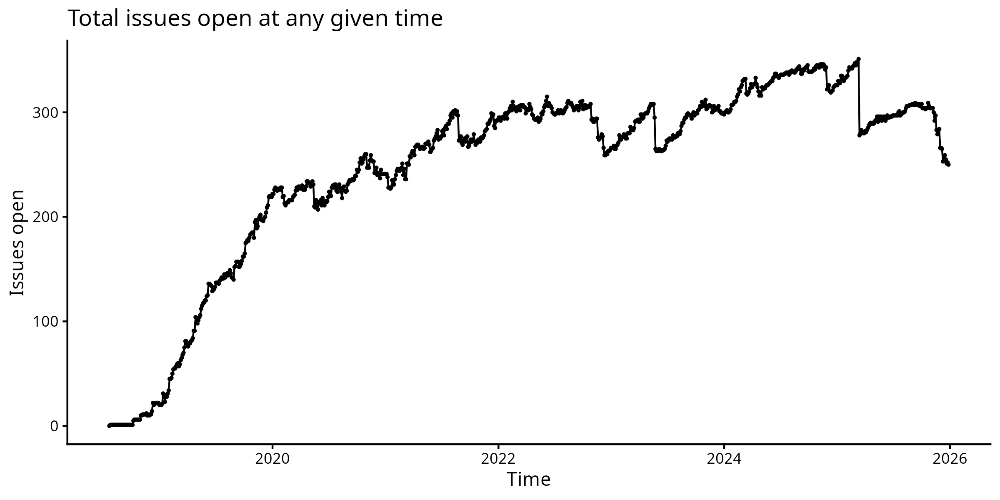
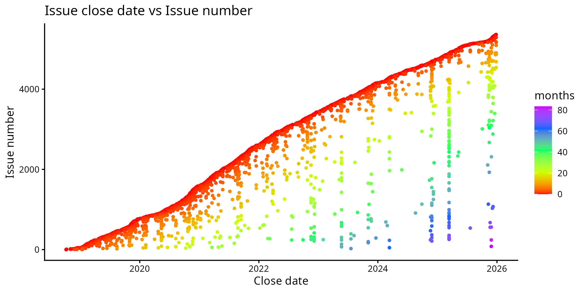

# shinyburndown

Generates "burndown" type charts about issues in your GitHub repo. Available as both a Shiny web app and a command-line tool.

**Live demo:** https://colindiesh.shinyapps.io/github_burndown/

## Screenshots



Simple graph of 'open issues over time'. Note that it includes open PRs as 'open issues'



This is my favorite chart where color reveals how long an issue has been open for, and then dots below the 'main curve' show old issues being closed. This can help show how both old and new issues are being solved. Note that some vertical stripes in this plot are basically closing stale issues


## Installation

### Install dependencies

```r
install.packages(c(
  "tidyverse",
  "lubridate",
  "gh",
  "glue",
  "cli",
  "fs",
  "shiny",
  "plotly"
))
```

Or install as a package (from the repo directory):

```r
# Install devtools if needed
install.packages("devtools")

# Install shinyburndown and all dependencies
devtools::install()
```

## Usage

### Shiny App

Run the interactive web app:

```r
shiny::runApp()
```

Or from the command line:

```bash
Rscript -e "shiny::runApp()"
```

### Command Line

```bash
Rscript burndown_cli.R <org/repo> [options]
```

**Examples:**

```bash
# Basic usage
Rscript burndown_cli.R GMOD/jbrowse-components

# Force refresh cached data
Rscript burndown_cli.R GMOD/jbrowse-components --refresh

# Custom output directory
Rscript burndown_cli.R GMOD/jbrowse-components --output-dir=plots

# Show summary only, skip plot generation
Rscript burndown_cli.R GMOD/jbrowse-components --no-plots

# Use colorblind-friendly viridis palette
Rscript burndown_cli.R GMOD/jbrowse-components --viridis
```

**Options:**

| Option | Description |
|--------|-------------|
| `--refresh` | Force refresh of cached data |
| `--output-dir=DIR` | Directory for output plots (default: `output`) |
| `--no-plots` | Skip generating plots, just show summary |
| `--viridis` | Use colorblind-friendly viridis color palette |
| `--width=N` | Plot width in inches (default: 8) |
| `--height=N` | Plot height in inches (default: 4) |

### GitHub Token

For repos with many issues, you may hit GitHub API rate limits. Set a token:

```bash
export GITHUB_TOKEN=your_token_here
```

Or create a `.Renviron` file:

```
GITHUB_TOKEN=your_token_here
```

Generate a token at: https://github.com/settings/tokens

## Caching

The CLI caches fetched data in `cache/<org>_<repo>.rds`. Subsequent runs load from cache unless `--refresh` is passed.

## Output

The CLI generates 7 plots in both PDF and PNG formats:

1. **months_vs_timespan** - Months to complete vs time span covered
2. **issues_timeline** - Issues completed over time
3. **completion_time** - Close date vs months taken
4. **close_date** - Close date vs issue number
5. **completion_histogram** - Distribution of time to complete
6. **open_issues** - Total issues open over time
7. **closed_per_day** - Issues closed per day distribution

## Deploy to shinyapps.io

```r
library(rsconnect)
deployApp()
```
